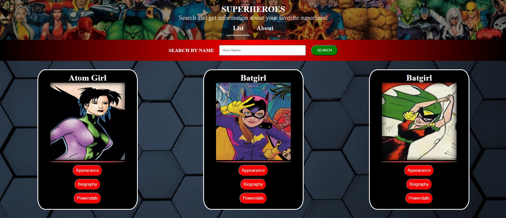
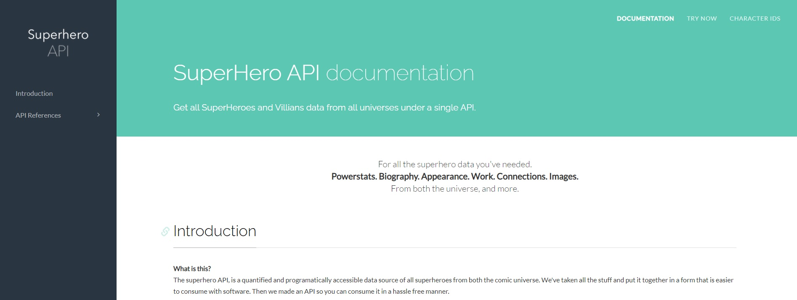

<h1 align="center">Superhero React Project</h1>

  

## Live Demo:

<strong>IMPORTANT:</strong> In order to avoid CORS restrictions for API request
from an unknown origin, Google Chrome offers an extension, so before you watch the live demo, please add the extension in your brower: [Click Here](https://chrome.google.com/webstore/detail/moesif-orign-cors-changer/digfbfaphojjndkpccljibejjbppifbc?hl=en-US)

# :arrow_right: [Live Demo](https://superheroes-react-project.herokuapp.com/#/)

## Author

:man: Julian Belmonte

- Github: [Julian Belmonte](https://github.com/jucora)
- Twitter: [@Julian Belmonte](https://www.twitter.com/JulianBelmonte)
- Linkedin: [Julian Belmonte](https://www.linkedin.com/in/julianbel)

## :pencil: Main Description

This project consists of the implementation of the fundamental concepts of the ReactJS library, as well as the use of Redux to manage the application state in an orderly manner and based on a single state throughout the application.

In order to offer persistence in the data, I decided to join Redux with LocalStorage, so that each change made in the Redux Store is automatically saved in the user's LocalStorage, in this way it is possible to refresh the browser and the information will remain available.

For more information about the project requirements, please follow the next link: [React capstone Project](https://www.notion.so/Catalogue-of-Dog-Clothes-8bf1512b8ab34fa28848beb8ab698a32)

  

## :lock_with_ink_pen: Superhero Api

  

I want to give my thanks to Superhero API since it is an excellent API with which I have been able to carry out this project.

The Superhero API, is a quantified and programatically accessible data source of all superheroes from both the comic universe. We've taken all the stuff and put it together in a form that is easier to consume with software. Then we made an API so you can consume it in a hassle free manner. Click the next link to access to the [API](https://www.superheroapi.com/)

## How to install the App

1. Please clone the repository by running the next comand in your machine:

<pre><code>git clone https://github.com/jucora/superheroes.git</code></pre>

2. Next, run the next command to install all project dependencies:

   For Yarn: <pre><code>yarn install</code></pre>
   For npm: <pre><code>npm install</code></pre>

## How to run the app locally

1. Get into the folder of the project by running the next command:

<pre><code>cd superheroes</code></pre>

2. Start your local server by running the next command:

   For Yarn: <pre><code>yarn start</code></pre>
   For npm: <pre><code>npm start</code></pre>

## :computer: Library, Languages and technologies

- React
- React-DOM
- Redux
- JSX
- SCSS
- Node.js
- prop-types
- npm
- Javascript
- LocalStorage

## Report Issues

Please feel free to make a contribution, report any issue, feature request or provide any feedback. Click [here](https://github.com/jucora/superheroes/issues)

## Support

Feel free to drop a like, that would support me a lot.
